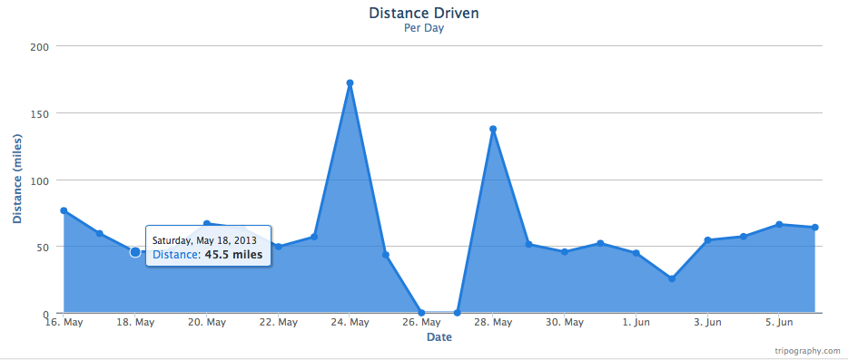

Tripography was a (now defunct) website that allowed Tesla owenrs to track and view their vehicle stats by retrieving vehicle telementry data using Tesla's (undocumented) API.

## Design and implementation 

Tripography is written using Spring MVC with all data stored in mongodb.

## Sample Charts

Tripography provides a few different charts to view your vehicle's analhytics.

### Daily miles

Shows miles driven per day over time.

### Histogram of Daily mileage

The distributon of daily miles driven.
